Esse repositório guarda meu material de estudo para a disciplina de Teoria dos grafos - Curso de Ciência da Computação - IESB/Sul - 2023.2.

# Grafos
Grafo é um par de conjuntos onde um primeiro conjunto são de vértices e o segundo conjunto são pares de vértices (arestas) que pertencem ao primeiro conjunto.
G = {V, A}
V = {1, 2, 4, 6, 5}
A = {(1, 2), (4, 5), (6, 1)} → Arestas: par de vértices aleatórios e não ordenados
## Grafos e árvores
Um grafo é uma árvore quando a quantidade de arestas é a quantidade de vértices menos 1 && não podem existir ciclos.
- Toda árvore é um grafo? VERDADEIRO.
- Todo grafo é uma árvore? FALSO.
## Formas de representação
Existem duas formas: matriz de adjacência (listar no formato de linha coluna todos os vértices) e lista de adjacências. É preciso "mapear" o grafo para saber seus vértices e arestas.

**OBS**: Não é pq um vértice não está conectado a outro vértice que ele não pertence ao grafo. Se faz parte do conjunto, faz parte do grafo.
## Lista de adjacências
A lista de adjacência é implementada usando uma lista encadeada, onde cada nó da lista (registro) representa um vértice adjacente. Isso permite uma representação eficiente de grafos, especialmente quando se trata de grafos esparsos, onde nem todos os vértices estão conectados entre si.

## Estruturas do código
Utiliza-se aqui três estruturas para compor o grafo, conforme o código abaixo.

```c
typedef struct vertice {
    int visitado;
    struct lista *lista_adjacencia;
} vertice;

typedef struct lista {
    int quantidade_elementos;
    struct registro *inicio;
} lista;

typedef struct registro {
    int valor;
    struct registro *proximo;
} registro;
```

A imagem abaixo organiza as estruturas das quais precisaremos. Cada uma delas tem uma cor e a seguir será explicado como funcionam.
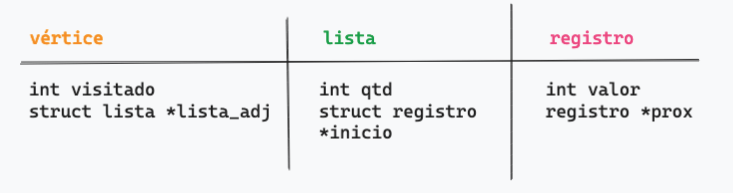

Para entender melhor como funciona, vamos seguir os seguintes passos:
1. Criamos os vértices A, B e C

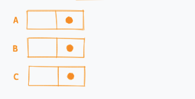

2. Inicializamos o campo visitado dos vértices (esse campo será utilizado quando precisarmos fazer buscas no grafo)
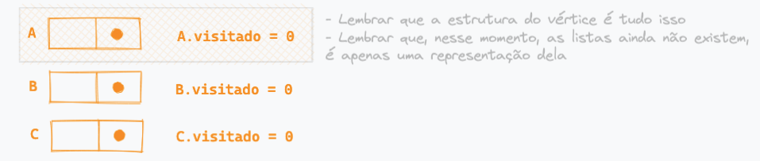

3. Vamos criar as listas de adjacências para os vértices


4. Criaremos os registros com seus valores


5. Vamos ligar um dos registros na lista de adjacência de A


6. Vamos dizer que o registro 1 está ligado (aponta) para o registro 2


7. Assim, imediatamente a lista A vai mudar, já que o registro que ela contém (1)
agora inclui seu vizinho (2), ou seja, aponta para alguém (2)
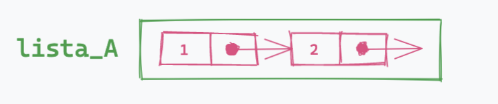

8. Não podemos esquecer de atualizar a quantidade de elementos na lista de adjacência de A
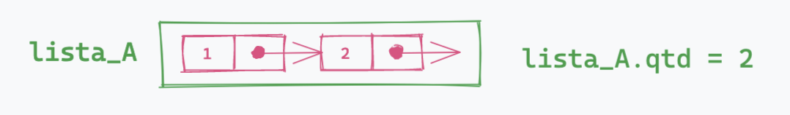

9. Também temos que atualizar o vértice A para ele apontar para a lista correta
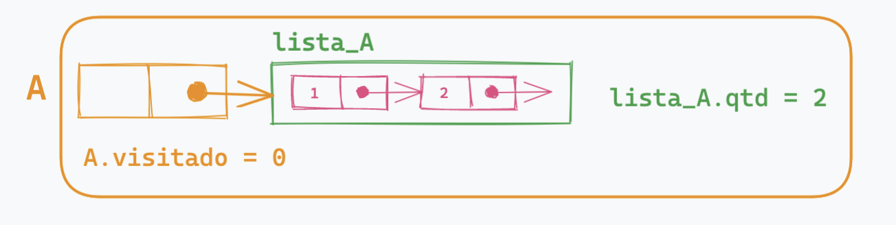

É assim que a estrutura de um vértice funciona nesse algoritmo. Dá pra entender que todas essas coisas estão conectadas. A lista não precisa guardar todos os vértices dentro dela porque o próprio vértice já tem em si a informação de pra quem ele vai apontar. Logo, sabendo o início da lista (de qual elemento se trata) e a quantidade de vértices vizinhos, conseguimos ter o controle de, posteriormente, percorrer essa lista de adjacências de um vértice.

## Algumas funções iniciais para desenvolver o grafo

Arquivo de referência para ver tudo funcionando: 01_introducao.c

Aqui vamos desenvolver:
- `inicializarLista();`
- `inicializarRegistro();`

Essas funções o nome já diz tudo. Elas alocam memória para que essas estruturas sejam inicializadas, para isso usamos o [calloc()](https://pt.stackoverflow.com/questions/179205/qual-%C3%A9-a-diferen%C3%A7a-entre-calloc-e-malloc).

- `addNaLista();`
- `imprimirLista();`

Essas funções servem para adicionar um novo registro numa lista e imprimir uma lista específica.

- `push();`

**Aqui a gente tá falando da elite**: serve para adicionar um registro na lista de adjacência de um vértice específico

- `imprimirGrafo();`

Imprime cada um dos vértices e suas listas de adjacências.

No arquivo de referência é muito importante notar a linha 88. Segue a `main` pra mostrar aqui:

```c
int main() {
    int qtd_vertices_grafo;
    int qtd_arestas_grafo;
    int a, b;

    printf("Digite a quantidade de vértices do grafo\n");
    scanf("%d", &qtd_vertices_grafo);
    vertice *vertices = (vertice*)calloc(10000, sizeof(vertice));

    printf("Digite a quantidade de arestas do grafo\n");
    scanf("%d", &qtd_arestas_grafo);

    printf("Digite as arestas do grafo:\n");
    for(int i = 0; i < qtd_arestas_grafo; i++) {
        scanf("%d %d", &a, &b);
        push(&vertices[a], b);
        push(&vertices[b], a);
    }

    printf("Hora da verdade:\n");
    imprimirGrafo(qtd_vertices_grafo, vertices);

    return 0;
}
```
Isso daqui `vertice *vertices = (vertice*)calloc(10000, sizeof(vertice));` é muito importante, porque vai garantir que a gente possa alocar um vetor de vértices e depois possa acessá-los, o que é basicamente a estrutura do grafo. 

A nossa função `push()` vai fazer todo o trabalho de adicionar uma nova aresta no grafo.

## DFS - Depth First Search (Busca em Profundidade)
Um algoritmo de busca é qualquer algoritmo que visita todos os vértices de um grafo andando pelas arestas de um vértice a outro. [Cada algoritmo de busca é caracterizado pela ordem em que visita os vértices](https://www.ime.usp.br/~pf/algoritmos_para_grafos/aulas/dfs.html). Nesse tópico vamos tratar do DFS ou Busca em Profundidade.

O objetivo é visitar todos os vértices de um grafo e conseguir entender a estrutura do grafo com o qual estamos lidando, revelando sua "forma" e reunindo informações (representadas pela numeração dos vértices) que ajudam a responder perguntas sobre o grafo. Você escolhe um caminho e vai nesse caminho até não conseguir mais, descendo pelos nós do grafo, primeiro pela direita. Quando não houver mais nós para visitar, volta pro último lugar onde você tinha uma opção ainda não visitada.

A estratégia para o algoritmo DFS é criar uma pilha de recursividade que vai lendo os elementos a partir da lista de adjacência e colocando-os em um vetor de "visitados" à medida em que vai colocando e tirando os elementos da pilha de recursividade. Fica mais simples de entender com o passo a passo abaixo.

1. Começamos com o grafo e a lista de adjacência dos vértices dele.
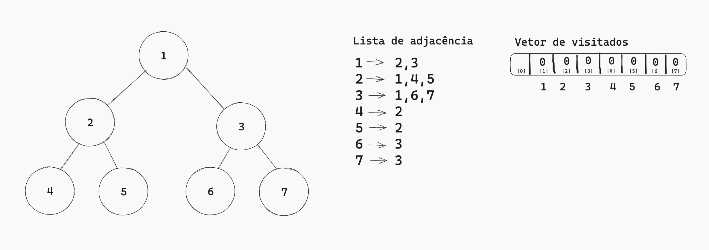

2. Devemos então começar pelo nó **1**. Verificamos no vetor de visitados que ele ainda não foi visitado. *OBS*: Note que aqui o nosso vetor de visitados vai de 0 a 7 então para facilitar a vida vamos usar no índice o mesmo número contido no vértice.
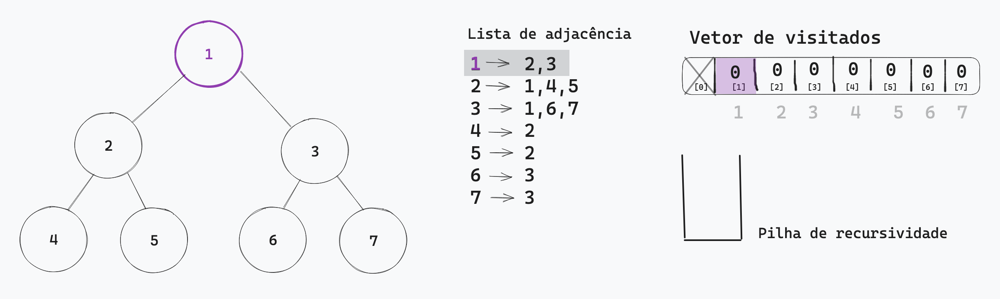

3. Se ele não foi visitado, indicamos que passamos por esse vértice e isso acontece quando atualizamos o vetor de visitados na posição **1**.
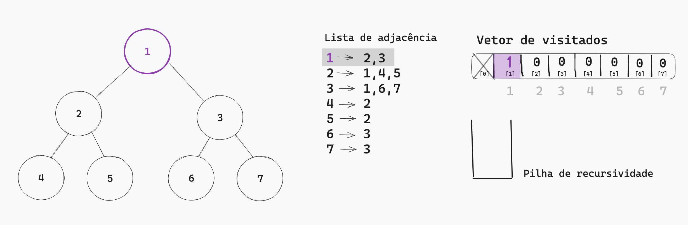

4. Em seguida, devemos adicionar o **1** na pilha de recursividade.
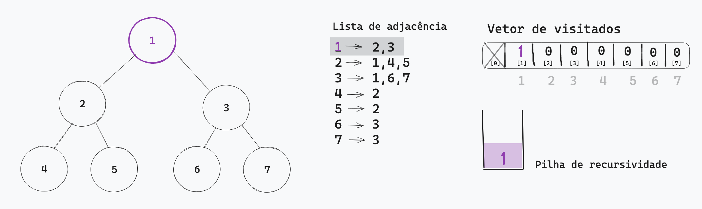

5. Como já visitamos o **1** e o adicionamos na pilha, vamos ao próximo vértice ao qual ele se conecta. Pela lista de adjacência podemos ver que se trata do vértice **2**.
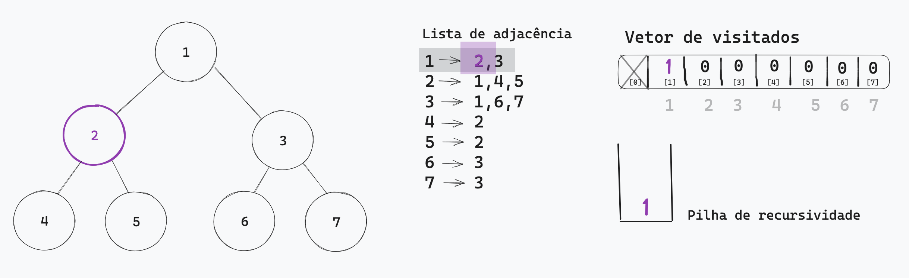

6. Verificamos se o **2** já foi visitado através do vetor de visitados. 
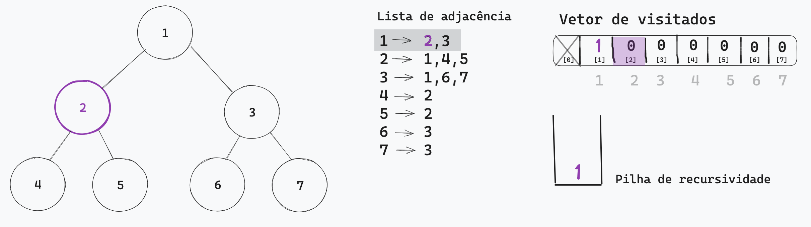

7. Como ele ainda não foi visitado, atualizamos o vetor para indicar que ele foi visitado.. 
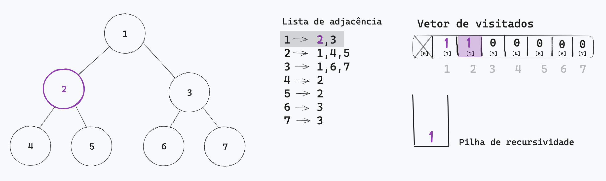

8. Em seguida, adicionamos o **2** na pilha de recursividade.


9. Com tudo do vértice **2** feito (checar se é visitado, adicionar na pilha de recursividade), vamos para o próximo vértice da lista de adjacência. Mas note: aqui, estamos no vértice **2**, logo, vamos visitar a lista de adjacência dele. Ajuda nesse ponto olhar para a pilha de recursividade e ver quem está no topo - é desse vértice que devemos tratar.
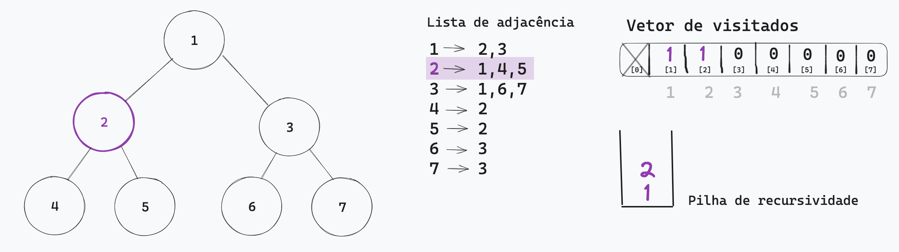

10. O primeiro vértice da lista de adjacência de **2** é o vértice **1**. Devemos conferir se ele foi visitado e, nesse caso, ele já foi.
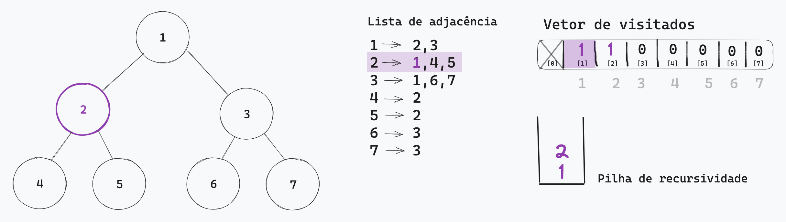

11. Então, vamos para o próximo vértice da lista, que é o vértice **4**. Mesma coisa: conferimos se ele foi visitado.
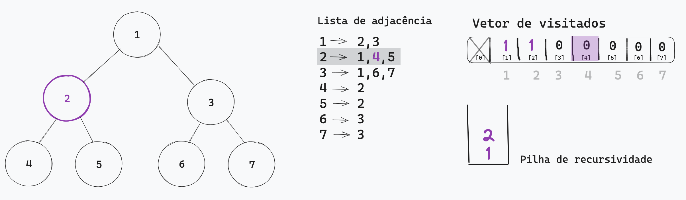

12. **4** não foi visitados? Atualizamos o vetor para indicar que o visitamos. Também o colocamos na pilha de recursividade.
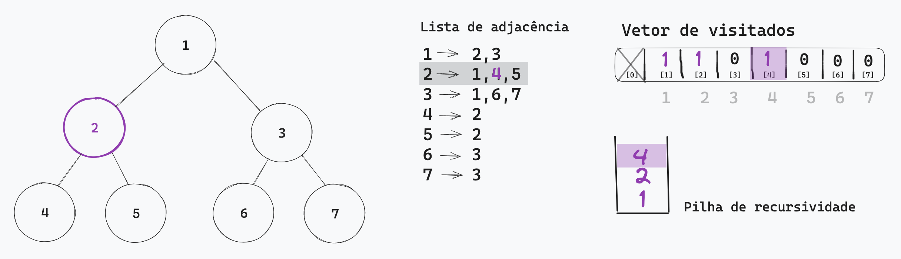

13. Estamos no vértice **4**, então vamos para a lista de adjacências dele.
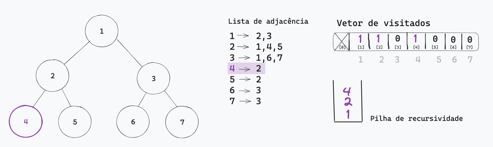

14. Mesmo processo que já fizemos antes: quem está na lista dele? O vértice **2**. Verificamos se ele já foi visitado.
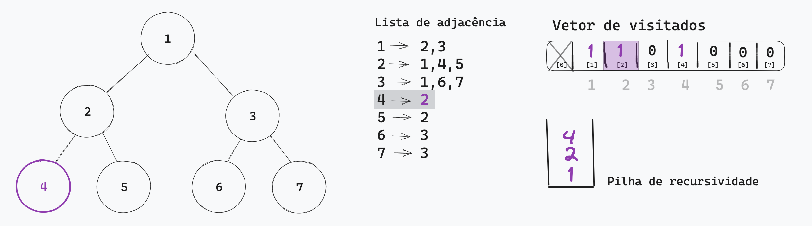

15. Aqui as coisas vão mudar. Encontramos que o vértice **2** já foi visitado no nosso grafo, então devemos seguir para o próximo vértice da lista de adjacências de **4**... porém não tem mais elementos nessa lista. Pela imagem, sabemos que **4** só tem uma aresta, ou seja, ele só se liga ao **2**. Como terminamos de mapear a lista de **4**, retiramos esse vértice da pilha de adjacência.
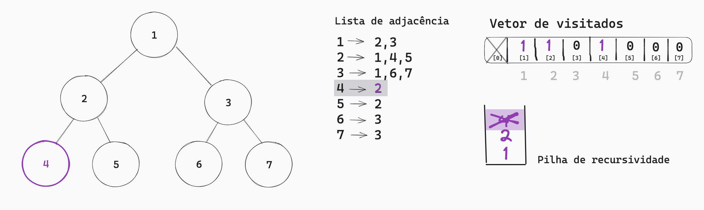

16. Então, agora devemos voltar para a lista do vértice **2**, pois é ele quem está na pilha de recursividade. O próximo elemento a ser visitado dessa lista é o **5**.
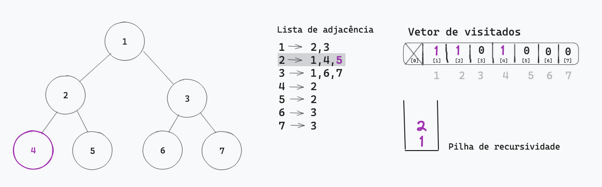

17. É feito o mesmo processo para o vértice **5**: colocamos na pilha de recursividade, verificamos se foi visitado (se não foi, atualizamos para visitado). E logo depois vamos percorrer a lista de adjacências dele.
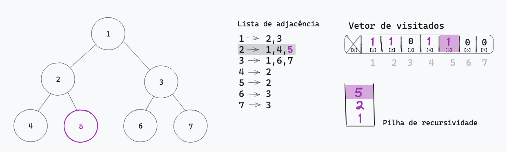

18. Quem está na lista do **5** é o vértice **2**, porém ele já foi visitado. Depois dele, não há mais vértices na lista.
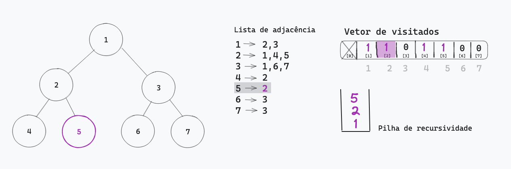

19. De volta para a lista de adjacências do **2**, não há mais vértices após o **5**. Assim, devemos retirá-lo da pilha de recursividade. Nesse momento, também acabamos de percorrer a lista de adjacências do vértice **2**. O processo então é o que já conhecemos: retirá-lo da pilha de recursividade e verificar qual número está nele: é o vértice **1**.
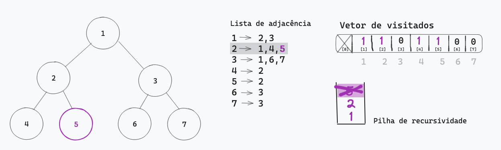

20. Ao voltar para o vértice **1**, vamos perceber que o **2** já foi visitado, indicando que o próximo deve ser colocado na pilha de recursividade e visitado. Esse é o vértice **3**. O processo se repete, de forma que o **3** seja visitado e todos os vértices em sua lista (**6** e **7**) também.
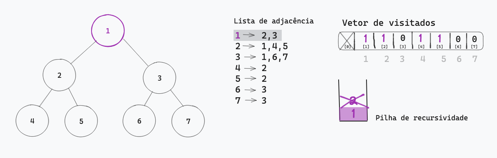

É assim que funciona a lógica do **dfs** que iremos utilizar para percorrer os grafos.

## Componentes conectados
O que determina quantos componentes conectados há num grafo? Dois vértices pertencem ao mesmo componente conectado quando consigo conectar do primeiro ao segundo vértice e do segundo ao primeiro. A e B pertencem ao mesmo componente conectado quando consigo ir de A para B e de B para A. Isso independe do caminho, mesmo que tenha que passar por outros vértices.
No grafo abaixo, os vértices 1, 2 e 3 estão conectados. Assim como 4 e 5. Porém os dois componentes não estão conectados entre si.
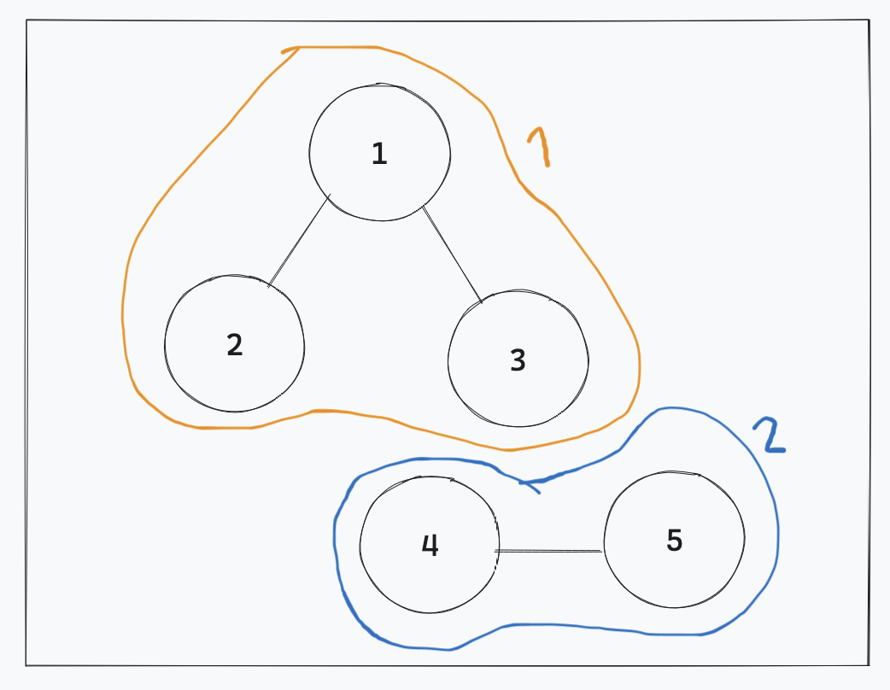
**a.** Componentes fortemente conectados: leva em consideração a seta direcionada. Na imagem abaixo há 1 componente fortemente conectado.

**b.** Componentes fracamente conectados: não leva em consideração a direção (como se a seta não existisse), leva em consideração só que existe a aresta. Na imagem abaixo há 2 componentes fortemente conectados.

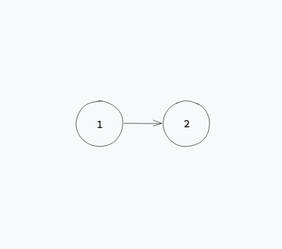

Como contar quantos componentes conectados há num grafo? Devemos percorrer o vetor de visitados e, pra toda vez que não tiver sido visitado, você vai fazer uma chamada dfs e pra toda vez que vc fizer uma chamada dfs você vai add 1 para a quantidade de componentes conectados → ou seja, a quantidade de raízes que você vai precisar pra percorrer o grafo. O [problema de contagem de componentes](https://github.com/maisamrr/teoriagrafos-estudos/tree/main/componentes) e o [problema resolvido do firescape](https://github.com/maisamrr/teoriagrafos-estudos/tree/main/firescape) abordam a contagem de componentes.
## Classificação
Existe uma classificação de grafos que separa grafos direcionais e grafos não-direcionais:
- Grafos não-direcionais: as arestas indicam a direção pros dois lados (indo e voltando)
- Grafos direcionais: as arestas possuem direção
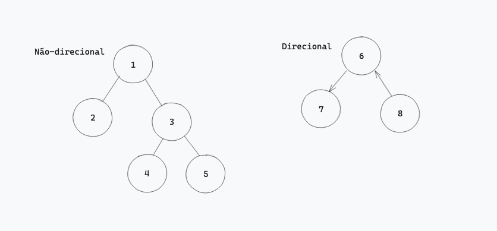

## Grafos bipartidos
Nesse tipo de grafo, os vértices vão ser classificados em dois grupos diferentes: as arestas conectam vértices de conjuntos diferentes.
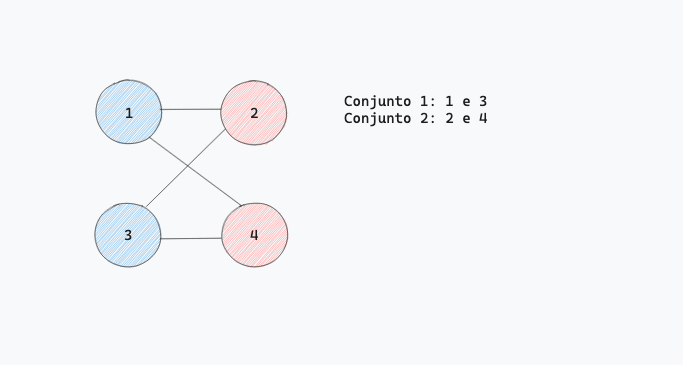

A lombra aqui é você conseguir ver se é bipartido sem estar pintado. Isso é feito percorrendo o grafo: todo mundo que tá conectado ao vértice tem que ser de outro conjunto. Vamos adicionar um parâmetro a mais, o conjunto a qual pertence e, sempre que percorrer a lista, deve verificar se o vértice é do conjunto oposto. No caso abaixo, os vértices são identificados com 1 ou -1 e devem pertencer a um desses conjuntos. Ao percorrer a lista de adjacências, deve-se conferir qual o conjunto de cada um dos vértices. O [problema dos insetos envolve](https://github.com/maisamrr/teoriagrafos-estudos/tree/main/bugs) grafo bipartido. 
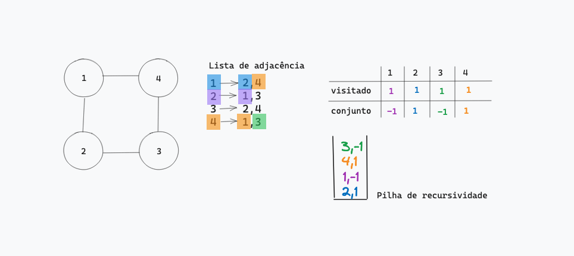

## Verificação de ciclos e detecção de back edges
Um ciclo em um grafo é um caminho fechado. Também pode ser definido como: para dois vértices A e B, há dois caminhos distintos - veja que na imagem abaixo podemos chegar em 3 pelo caminho 1-3 e 1-2-3. Para ele ser detectado, devemos encontrar no processo de busca do dfs um vértice que já tenha sido visitado e não é o vértice pai do vértice em questão.
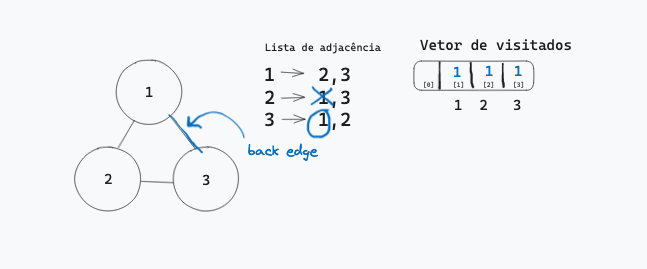

Nesse exemplo acima, percorrendo a lista de adjacências do 3, eu encontro o 1. Ele já foi visitado e não é o vértice pai de 3, porque ele veio do 2. É importante ressaltar que quem define o **back edge** é a ordem do dfs. O [problema de detectar se um grafo é uma árvore](https://github.com/maisamrr/teoriagrafos-estudos/tree/main/tree) trata desse assunto. 

## BFS - Breadth First Search (Busca em largura)
O que difere uma estratégia de busca é a [ordem em que os vértices são visitados](https://www.ime.usp.br/~pf/algoritmos_para_grafos/aulas/bfs.html). 

## Prova P1 - questões e conteúdos
- [Firescape problem](https://www.codechef.com/problems/FIRESC)
- [Problema de detectar se é árvore](https://www.spoj.com/problems/PT07Y/)
- [Vida de inseto](https://www.spoj.com/problems/BUGLIFE/)
- [Problema do monge e as ilhas](https://www.hackerearth.com/practice/algorithms/graphs/breadth-first-search/practice-problems/algorithm/monk-and-the-islands/)
- Grafos e árvores
- BFS, DFS e SSSP (Single Source Short Path - Menor Caminho Único)
- Vertificação de ciclos e detecção de back edge
- Contagem de componentes
- Grafo bipartido
- Diâmetro de um grafo
- Como vai ser a prova: 2 exercícios de codar (2,5 pts cada) e 6 questões de marcar (0,5 pts cada). 

## Referências
[SOpt](https://github.com/maniero/SOpt/tree/master/C)

[Busca em profundidade - IME-USP](https://www.ime.usp.br/~pf/algoritmos_para_grafos/aulas/dfs.html)

[Busca em largura - IME-USP](https://www.ime.usp.br/~pf/algoritmos_para_grafos/aulas/bfs.html)

[Imagem usada para ilustrar pré-ordem](https://pythonhelp.wordpress.com/2015/01/19/arvore-binaria-de-busca-em-python/)

[Table of contents generated with markdown-toc](http://ecotrust-canada.github.io/markdown-toc/)