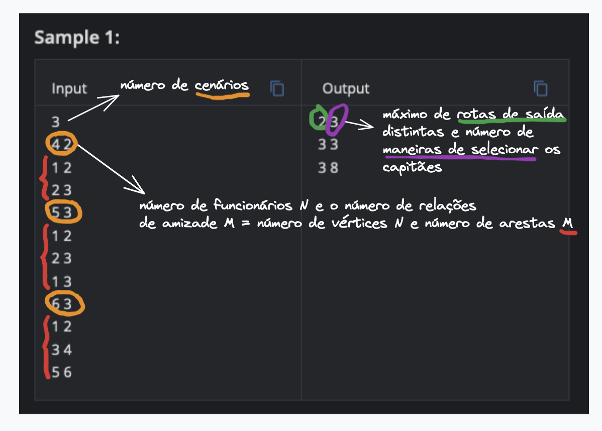
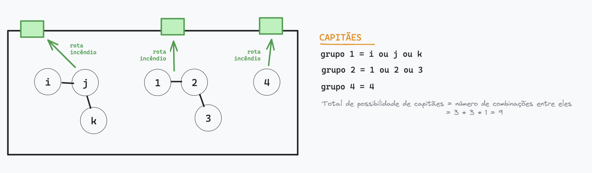
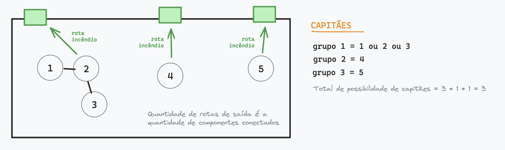
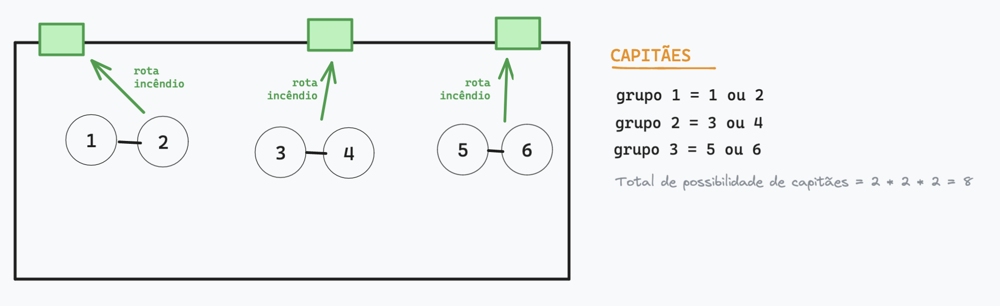

## Firescape - [codechef](https://www.codechef.com/problems/FIRESC)
Há N pessoas trabalhando em um prédio, e cada uma trabalha em uma cabine separada. Os funcionários da chefe são numerados por inteiros de 1 a N, incluindo N. A chefe deseja garantir a segurança de seus funcionários. Ela quer ter saídas de incêndio no prédio e quer treinar os funcionários para usá-las, realizando simulações de treinamento.

A chefe sabe que o número de pessoas trabalhando em seu escritório pode ser muito grande. Para evitar aglomeração em uma rota comum de saída de incêndio durante uma emergência, ela decidiu construir várias saídas de incêndio. Para garantir a segurança de cada funcionário, cada cabine possui uma saída de incêndio que está conectada a uma das rotas de saída de incêndio.

Muitos funcionários são amigos entre si. A amizade é mútua, o que significa que se o funcionário *i* é amigo do funcionário *j*, então o funcionário *j* também é amigo do funcionário *i*. No entanto, a amizade não é necessariamente transitiva. Isso significa que se o funcionário *i* é amigo do funcionário *j* e o funcionário *j* é amigo do funcionário *k*, não é necessário que o funcionário *i* e o funcionário *k* sejam necessariamente amigos.

Se dois funcionários são amigos, eles não desejam escapar por rotas diferentes. Isso complica a tarefa para a chefe. Como já mencionado, ela deseja ter o **máximo de rotas de saída de incêndio** para garantir a máxima segurança. Além disso, para cada rota de fuga, um dos funcionários que a utiliza precisa ser designado como capitão do treinamento de incêndio. O capitão será responsável por conduzir as simulações de treinamento e treinar todos os funcionários que usam aquela rota. Sua tarefa é simples. Dado o número de funcionários e a lista de amizades, você precisa informar à chefe o número máximo de rotas de saída de incêndio que ela pode ter no prédio e o número de maneiras de selecionar os capitães para cada rota. Como o número de maneiras pode ser realmente grande, emita esse valor módulo 10^9 + 7.

## Entrada
- A primeira linha da entrada contém um único inteiro T, indicando o número de casos de teste. A descrição dos casos de teste T segue.
- A primeira linha de cada caso de teste contém dois inteiros separados por espaço, N e M, indicando o número de funcionários e o número de relações de amizade, respectivamente.
- Cada uma das M linhas seguintes contém dois inteiros separados por espaço, *i* e *j*, indicando que o funcionário *i* e o funcionário *j* são amigos.

## Saída
Para cada caso de teste, emita uma única linha contendo dois inteiros separados por espaço, indicando o número máximo de rotas de saída de incêndio distintas que podem ser construídas e o número de maneiras de selecionar os capitães módulo 10^9 + 7.

## Restrições
- 1 ≤ T ≤ 5
- 1 ≤ N ≤ 10^5
- 1 ≤ N ≤ 10^5
- 0 ≤ M ≤ 10^5
- 0 ≤ M ≤ 10^5
- 1 ≤ i,j≤ N 
- 1 ≤ i,j ≤ N
- i ≠ j
- i != j
- Para qualquer par de funcionários *i* e *j*, onde 1 ≤ i,j ≤ N, no máximo um par entre (*i,j*) e (*j,i*) aparecerá na entrada.

## Explicação
**Exemplo do caso 1:** Aqui, os funcionários 1 e 2 são amigos e devem compartilhar a mesma saída de incêndio. Além disso, os funcionários 2 e 3 compartilham a mesma saída de incêndio. Isso significa que os funcionários 1, 2 e 3 terão uma rota comum. No entanto, para maximizar o número de rotas, a chefe poderia designar outra rota ao funcionário 4, já que ele não é amigo de nenhum outro funcionário. Portanto, temos duas rotas de fuga com a seguinte distribuição de funcionários por rotas: {1,2,3}, {4}. Portanto, existem 3 maneiras de escolher os capitães do treinamento: (1,4), (2,4) e (3,4), onde o primeiro elemento no par denota o capitão da primeira rota e o segundo elemento denota o capitão da segunda rota.

**Exemplo do caso 2:** Aqui, a distribuição ótima de funcionários por rotas é {1,2,3}, {4}, {5}. Portanto, existem 3 maneiras de escolher os capitães do treinamento: (1,4,5), (2,4,5) e (3,4,5).

**Exemplo do caso 3:** Aqui, a distribuição ótima de funcionários por rotas é {1,2}, {3,4}, {5,6}. Portanto, existem 8 maneiras de escolher os capitães do treinamento: (1,3,5), (1,3,6), (1,4,5), (1,4,6), (2,3,5), (2,3,6), (2,4,5) e (2,4,6).
